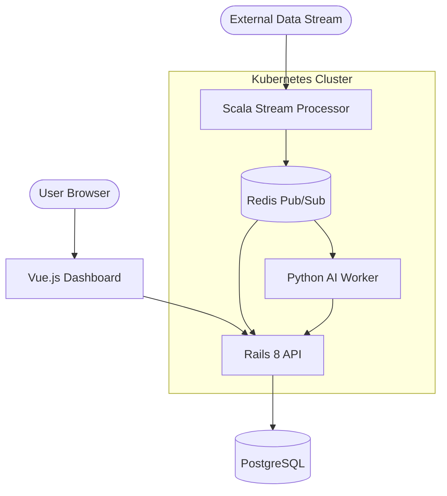

# Global Pulse: Real-time Cloud Platform

## 🏗️ System Architecture

This project follows a polyglot microservices architecture designed for high availability and real-time data processing.

## 🛠️ Technology Stack
- **Control API**: Ruby on Rails 8 (Solid Cable, Solid Cache)
- **Stream Processor**: Scala 3 (Akka Streams)
- **Analysis Worker**: Python (FastAPI + OpenCV)
- **Frontend**: Vue.js 3 + Vite
- **Infrastructure**: Kubernetes (K8s), Docker, Render (Free Tier)
